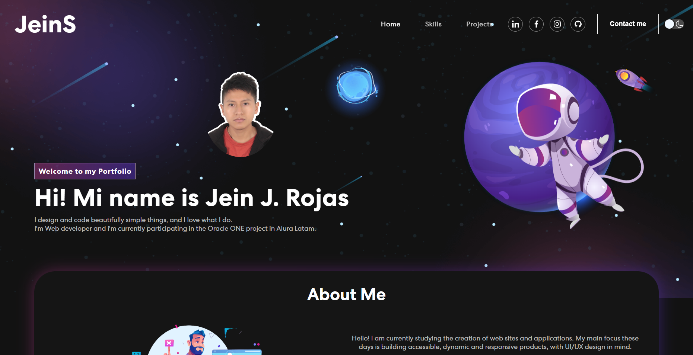

# Portfalio


# Demo
[Puedes ver el proyecto aquí 🚀](https://tourmaline-sable-24956a.netlify.app)
---
### Portafolio hecho en React y usando dos librerías (react-multi-carousel and emailjs).
---
# Getting Started
Clona este repositorio en tu maquina local usando el comando "git clone".
```
    # Clone the repository
    $ git clone https://github.com/jeinszz01/Portfolio.git
    # Move into the repository
    $ cd my-portfolio
```

* Instala las dependencias
```
    $ npm install
```

* Inicia el servidor con
```
    $ npm run vite
```

# Stack and tools 🛠️
[React](https://es.reactjs.org)

[react-multi-carousel](https://www.npmjs.com/package/react-multi-carousel)

[emailjs](https://www.emailjs.com
)
